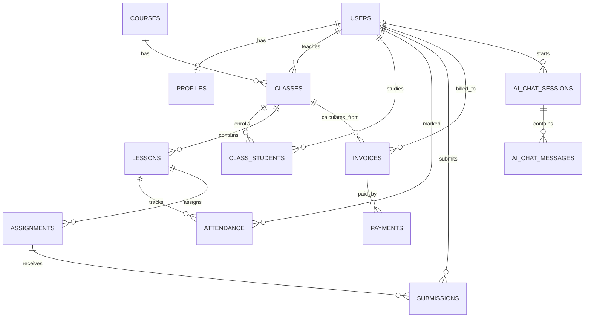
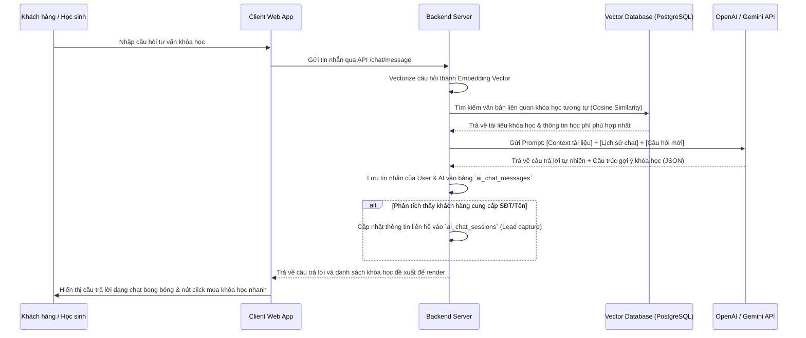

# TÀI LIỆU ĐẶC TẢ KỸ THUẬT VÀ CHỨC NĂNG CHI TIẾT (TECHNICAL & PRD SYSTEM SPECIFICATION)
## HỆ THỐNG QUẢN LÝ TRUNG TÂM HỌC THÊM ONLINE (LMS & CENTRAL MANAGEMENT SYSTEM)

Tài liệu đặc tả toàn diện phục vụ phát triển hệ thống quản lý trung tâm dạy thêm, tích hợp cổng thanh toán tự động, phòng học ảo trực tuyến và **Phân hệ trợ lý AI tư vấn tuyển sinh & gợi ý khóa học thông minh**.

---

## 1. Sơ đồ Phân quyền & Vai trò (Roles & Permissions)

Hệ thống hoạt động dựa trên phân quyền nghiêm ngặt dựa trên vai trò (RBAC - Role-Based Access Control) với các đặc quyền sau:

| Chức năng | Admin / Quản lý | Nhân viên vụ | Giáo viên | Học sinh | Phụ huynh | Khách vãng lai |
| :--- | :---: | :---: | :---: | :---: | :---: | :---: |
| Quản lý cấu hình hệ thống & API Key AI | **X** | | | | | |
| Quản lý tài chính, học phí | **X** | **X** (Giới hạn) | | | **X** (Xem & Pay) | |
| Tạo khóa học & Lớp học | **X** | **X** | | | | |
| Quản lý giáo án, bài tập | **X** | | **X** | **X** (Làm bài) | | |
| Điểm danh & Nhận xét | **X** | **X** | **X** | | **X** (Xem) | |
| Xem lịch học & Phòng học Online | **X** | **X** | **X** | **X** | **X** (Xem) | |
| Trò chuyện với AI tư vấn khách hàng | **X** | **X** | | **X** | **X** | **X** |
| Nhận đề xuất khóa học từ AI | **X** | **X** | | **X** | **X** | **X** |
| Thống kê & Báo cáo | **X** | **X** (Giới hạn) | **X** (Lớp dạy) | | | |

---

## 2. Kiến trúc Cơ sở Dữ liệu Chi tiết (Database Schema Design)

Sử dụng cơ sở dữ liệu quan hệ (RDBMS) tích hợp lưu trữ Vector (ví dụ: PostgreSQL với extension `pgvector`) để thực hiện tìm kiếm ngữ nghĩa cho hệ thống đề xuất khóa học bằng AI.



### 2.1 Các bảng hệ thống cốt lõi
* **`users`**: `id` (INT PK), `email` (VARCHAR Unique), `phone` (VARCHAR Unique), `password_hash` (VARCHAR), `full_name` (VARCHAR), `role` (ENUM), `status` (ENUM), `created_at` (TIMESTAMP).
* **`profiles`**: `id` (INT PK), `user_id` (INT FK -> `users.id`), `dob` (DATE), `gender` (ENUM), `address` (VARCHAR), `parent_id` (INT FK -> `users.id` - liên kết con-phụ huynh), `teacher_bio` (TEXT), `teacher_bank_name`, `teacher_bank_account`.
* **`courses`**: `id` (INT PK), `course_code` (VARCHAR Unique), `title` (VARCHAR), `description` (TEXT), `base_price` (DECIMAL), `total_lessons` (INT), `metadata_tags` (JSON - từ khóa môn học, trình độ, mục tiêu), `embedding_vector` (VECTOR(1536) - Vector biểu diễn mô tả khóa học phục vụ gợi ý AI), `status` (ENUM).
* **`classes`**: `id` (INT PK), `course_id` (INT FK -> `courses.id`), `teacher_id` (INT FK -> `users.id`), `class_name` (VARCHAR), `max_students` (INT), `start_date` (DATE), `end_date` (DATE), `schedule` (JSON), `status` (ENUM).
* **`class_students`**: `id` (INT PK), `class_id` (INT FK), `student_id` (INT FK), `enrolled_at`, `status` (ENUM). Unique Key: (`class_id`, `student_id`).
* **`lessons`**: `id` (INT PK), `class_id` (INT FK), `title` (VARCHAR), `lesson_date` (DATE), `start_time` (TIME), `end_time` (TIME), `meeting_url` (VARCHAR), `meeting_id`, `meeting_password`, `status` (ENUM).
* **`attendance`**: `id` (INT PK), `lesson_id` (INT FK), `student_id` (INT FK), `status` (ENUM: Present, Late, Absent), `remark` (VARCHAR), `updated_at`. Unique Key: (`lesson_id`, `student_id`).
* **`assignments`**: `id` (INT PK), `lesson_id` (INT FK), `title` (VARCHAR), `instruction` (TEXT), `attachment_url` (VARCHAR), `due_date` (TIMESTAMP), `assignment_type` (ENUM: QUIZ, ESSAY), `quiz_data` (JSON).
* **`submissions`**: `id` (INT PK), `assignment_id` (INT FK), `student_id` (INT FK), `submitted_at` (TIMESTAMP), `content` (TEXT), `file_url` (VARCHAR), `grade` (DECIMAL), `teacher_comment` (TEXT), `graded_at`. Unique Key: (`assignment_id`, `student_id`).
* **`invoices`**: `id` (INT PK), `invoice_code` (VARCHAR Unique), `student_id` (INT FK), `class_id` (INT FK), `amount` (DECIMAL), `due_date` (DATE), `status` (ENUM), `created_at`.
* **`payments`**: `id` (INT PK), `invoice_id` (INT FK), `transaction_code` (VARCHAR Unique), `amount` (DECIMAL), `payment_method` (ENUM), `payment_time` (TIMESTAMP), `raw_webhook_data` (JSON).

### 2.2 Các bảng phục vụ phân hệ AI tư vấn & Đề xuất
* **`ai_chat_sessions`** (Quản lý phiên chat AI):
  * `id` (INT, Primary Key, Auto Increment)
  * `user_id` (INT, Foreign Key -> `users.id`, Nullable - hỗ trợ khách vãng lai chưa đăng nhập)
  * `session_token` (VARCHAR(100), Unique) - Token định danh phiên lưu trên Client cookie.
  * `lead_name` (VARCHAR(100), Nullable) - Tên khách hàng (AI tự khai thác trong cuộc đối thoại).
  * `lead_phone` (VARCHAR(15), Nullable) - SĐT khách hàng (AI tự khai thác).
  * `summary` (TEXT, Nullable) - Tóm tắt nhu cầu học tập của khách do AI tự đúc kết sau cuộc trò chuyện.
  * `created_at` (TIMESTAMP)
* **`ai_chat_messages`** (Lưu lịch sử hội thoại):
  * `id` (INT, Primary Key, Auto Increment)
  * `session_id` (INT, Foreign Key -> `ai_chat_sessions.id` ON DELETE CASCADE)
  * `sender_type` (ENUM('USER', 'AI'))
  * `message_content` (TEXT)
  * `created_at` (TIMESTAMP)
* **`user_learning_profiles`** (Hồ sơ hành vi để AI phân tích gợi ý khóa học):
  * `id` (INT, Primary Key, Auto Increment)
  * `student_id` (INT, Foreign Key -> `users.id`, Unique)
  * `weak_areas` (JSON) - Các mảng kiến thức yếu (Phân tích từ điểm số các bài kiểm tra).
  * `preferred_learning_style` (VARCHAR(50)) - Phong cách học ưa thích.
  * `last_analyzed_at` (TIMESTAMP)

---

## 3. Bản đồ Route / URL điều hướng

* `/login` & `/register` & `/forgot-password` - Tuyến đường dùng chung.
* `/ai-advisor` - Trang công cộng cho khách vãng lai và học viên vào trò chuyện trực tiếp với AI tư vấn tuyển sinh & định hướng học tập.
* `/admin/*` - Giao diện quản trị viên (dashboard, quản lý lớp, hóa đơn, xem báo cáo leads từ chatbot AI).
* `/teacher/*` - Giao diện giáo viên (dạy học, chấm điểm, điểm danh).
* `/student/*` - Giao diện học sinh (vào lớp học, làm bài tập, xem **mục đề xuất khóa học dành riêng cho bạn từ AI**).
* `/parent/*` - Giao diện phụ huynh (xem tình hình học, đóng học phí).

---

## 4. Danh sách Phân hệ Chức năng & API Trợ lý AI

### Phân hệ 7: AI Tư vấn Tuyển sinh & Đề xuất Khóa học (AI Assistant System)

#### 4.1 Chatbot AI tư vấn thông minh (AI Conversational Agent)
* **Mô tả:** chatbot AI tự động xuất hiện dưới dạng Bong bóng Chat (Floating Widget) hoặc trang `/ai-advisor` độc lập.
* **Nghiệp vụ tư vấn:**
  * Giải đáp thông tin về trung tâm (Lịch sử, cơ sở vật chất, giáo viên tiêu biểu).
  * Trả lời chi tiết nội dung học, lộ trình học của từng khóa học hiện có.
  * Tự động phỏng vấn nhu cầu: Khách muốn học môn gì? Lớp mấy? Mục tiêu (Thi đại học, ôn học sinh giỏi, lấy lại gốc)? Học phí mong muốn?
  * **Thu thập Lead tự động:** Khi phát hiện khách hàng tiềm năng có thiện chí, AI tự động gợi ý xin thông tin Họ tên & SĐT để nhân viên gọi lại hỗ trợ, tự động cập nhật vào CSDL để nhân viên tuyển sinh CSKH.
  * **Tích hợp RAG (Retrieval-Augmented Generation):** Dữ liệu trả lời của AI được truy xuất trực tiếp từ kho tri thức trung tâm (Vector Database chứa tài liệu khóa học, chính sách trung tâm) để tránh hiện tượng AI ảo tưởng (Hallucination).

#### 4.2 Công cụ Đề xuất khóa học thông minh (AI Recommendation Engine)
* **Đề xuất cho Khách vãng lai/Học viên mới:** Dựa vào nội dung hội thoại chat, AI phân tích ý định của khách và đề xuất top 3 khóa học phù hợp nhất kèm liên kết đăng ký học thử.
* **Đề xuất cho Học viên hiện hữu (Personalized Learning Path):**
  * Tác vụ ngầm (Background Job) hàng tuần phân tích kết quả bài tập (`submissions.grade`) và chuyên cần (`attendance`) của học sinh.
  * Xác định các điểm yếu (Ví dụ: Học sinh A có điểm các bài kiểm tra về "Hình học không gian" dưới 5.0).
  * AI quét kho khóa học hiện có và tự động đề xuất chuyên đề bổ trợ (Ví dụ: Khóa học ngắn hạn ôn tập "Hình học không gian lớp 11") hiển thị trực tiếp trên Dashboard của học sinh.

#### 4.3 AI phân tích tiến độ học tập (AI Student Progress Analytics)
* **Mô tả:** Hệ thống AI quét toàn bộ dữ liệu học tập của học viên trong một lớp để phân loại học sinh thành 2 nhóm chính giúp giáo viên và admin dễ dàng quản trị và can thiệp:
  * **Nhóm 1: Học sinh chậm tiến độ (At-Risk / Slow Progress):**
    * *Điều kiện nhận diện:* Điểm trung bình bài tập (`submissions.grade`) < 5.0, HOẶC tỷ lệ hoàn thành nộp bài tập (số bài đã nộp / tổng số bài đã giao) < 70%, HOẶC tỷ lệ đi học vắng mặt (`attendance` có trạng thái `ABSENT_UNEXCUSED` hoặc `ABSENT_REQUESTED`) > 20%.
    * *Đề xuất hành động của AI:* Đưa ra cảnh báo cho Giáo viên/Admin gửi email/SMS nhắc nhở phụ huynh học sinh, hoặc tự động đề xuất bài tập trắc nghiệm lấy lại căn bản ngắn để học sinh tự làm củng cố kiến thức.
  * **Nhóm 2: Học sinh hoàn thành tốt (Exemplary / Outstanding Progress):**
    * *Điều kiện nhận diện:* Điểm trung bình bài tập > 8.5, tỷ lệ hoàn thành nộp bài tập = 100%, tỷ lệ đi học đầy đủ (`PRESENT`) > 95%.
    * *Đề xuất hành động của AI:* Gợi ý giáo viên khen ngợi trên bảng tin, phát hành chứng nhận điện tử "Học sinh xuất sắc tuần/tháng", hoặc đề xuất các khóa học nâng cao ở cấp độ tiếp theo.

---

### 4.4 Đặc tả API Chức năng AI (API AI Specification)

#### POST `/api/v1/ai/chat/message`
* **Mô tả:** Gửi tin nhắn trò chuyện với AI tư vấn.
* **Request Body:**
  ```json
  {
    "session_token": "sess_98234123_abc",
    "message": "Con tôi năm nay lên lớp 10, học lực trung bình môn Toán thì nên đăng ký khóa nào ôn hè?"
  }
  ```
* **Response (Success 200):**
  ```json
  {
    "success": true,
    "reply": "Chào anh/chị, với học sinh lớp 9 lên 10 có học lực trung bình, trung tâm có khóa ôn hè 'TOAN10_MATGOC' (Lấy lại gốc Toán 10) giúp củng cố kiến thức nền tảng. Khóa này có 12 buổi học online tương tác cao. Tôi có thể đề xuất khóa này cho anh chị không?",
    "suggested_courses": [
      {
        "id": 4,
        "course_code": "TOAN10_MATGOC",
        "title": "Lấy lại gốc Toán lớp 10",
        "price": 1200000.00
      }
    ],
    "lead_captured": {
      "detected": false
    }
  }
  ```

#### GET `/api/v1/student/recommendations`
* **Mô tả:** Lấy danh sách các khóa học được AI đề xuất riêng cho học sinh dựa trên học lực hiện tại.
* **Response (Success 200):**
  ```json
  {
    "success": true,
    "student_id": 105,
    "analysis": {
      "weaknesses": ["Hình học không gian", "Tích phân"],
      "explanation": "Dựa trên kết quả bài tập tuần 24 và 25 môn Toán có điểm số dưới 5.5, hệ thống AI nhận thấy bạn đang gặp khó khăn ở phần Hình học không gian."
    },
    "recommendations": [
      {
        "id": 12,
        "course_code": "TOAN11_HINHHOC_SPECIAL",
        "title": "Chuyên đề bứt phá Hình học không gian 11",
        "match_score": 0.95,
        "reason": "Giúp bổ trợ trực tiếp lỗ hổng kiến thức hình học không gian lớp 11 của bạn."
      }
    ]
  }
  ```

#### GET `/api/v1/teacher/classes/:classId/ai-progress-analysis`
* **Mô tả:** Giáo viên lấy danh sách học sinh chậm tiến độ và học sinh xuất sắc do AI tự phân tích.
* **Response (Success 200):**
  ```json
  {
    "success": true,
    "class_id": 12,
    "analyzed_at": "2026-06-17T23:38:00Z",
    "students_at_risk": [
      {
        "student_id": 45,
        "student_name": "Trần Văn Bình",
        "average_grade": 4.2,
        "assignment_completion_rate": 0.60,
        "attendance_rate": 0.75,
        "ai_alert_reason": "Điểm trung bình dưới trung bình và vắng 25% số buổi học.",
        "recommended_action": "Gửi SMS nhắc nhở phụ huynh và tạo bài tập bổ trợ lấy lại gốc 'Hình học phẳng'."
      }
    ],
    "students_exemplary": [
      {
        "student_id": 88,
        "student_name": "Lê Thị Hồng",
        "average_grade": 9.4,
        "assignment_completion_rate": 1.00,
        "attendance_rate": 1.00,
        "ai_alert_reason": "Điểm trung bình xuất sắc và làm bài tập đầy đủ, đi học chuyên cần tuyệt đối.",
        "recommended_action": "Vinh danh học sinh xuất sắc và đề xuất tuyển thẳng vào lớp chuyên Toán nâng cao TOAN10_NANGCAO."
      }
    ]
  }
  ```

---

## 5. Thiết kế Luồng Nghiệp vụ & Thuật toán AI (Core AI Workflows)

### 5.1 Luồng RAG Tư vấn & Đăng ký Khóa học của Chatbot AI


### 5.2 Thuật toán Đối chiếu Embedding đề xuất khóa học (Semantic Course Recommendation)
* **Quy trình:**
  1. Khi Admin tạo mới hoặc cập nhật một khóa học (`courses`), hệ thống tự động gộp: `title` + `description` + `metadata_tags` thành một đoạn text mô tả chuẩn.
  2. Gửi đoạn text này tới mô hình tạo Embedding (ví dụ: `text-embedding-3-small`) để nhận về mảng vector 1536 chiều, lưu vào trường `embedding_vector` của bảng `courses`.
  3. Khi AI phân tích cuộc trò chuyện của khách hàng tìm ra từ khóa nhu cầu (ví dụ: "Tìm lớp luyện thi đại học môn Vật lý cấp tốc"), hệ thống vector hóa câu truy vấn nhu cầu này.
  4. Thực hiện truy vấn khoảng cách Vector (Cosine Distance hoặc Inner Product) trong SQL:
     ```sql
     SELECT id, title, base_price, 
            (1 - (embedding_vector <=> :query_vector)) AS similarity
     FROM courses
     WHERE status = 'ACTIVE'
     ORDER BY similarity DESC
     LIMIT 3;
     ```
  5. Trả về 3 khóa học có điểm tương đồng cao nhất cho khách hàng.

### 5.3 Thuật toán Phân tích & Phân loại học viên tự động bằng AI (AI Student Progress Analyzer Workflow)
* **Quy trình chạy ngầm định kỳ (Cron Job 23:00 tối Chủ nhật hàng tuần):**
  1. Hệ thống truy vấn danh sách tất cả học viên đang học trong các lớp Active.
  2. Đối với mỗi học viên, hệ thống tính toán:
     * `avg_grade = SELECT AVG(grade) FROM submissions WHERE student_id = :student_id`
     * `submission_rate = (SELECT COUNT(id) FROM submissions WHERE student_id = :student_id) / (SELECT COUNT(id) FROM assignments WHERE class_id = :class_id AND due_date < NOW())`
     * `attendance_rate = (SELECT COUNT(id) FROM attendance WHERE student_id = :student_id AND status = 'PRESENT') / (SELECT COUNT(id) FROM attendance WHERE student_id = :student_id)`
  3. Hệ thống tổng hợp các thông số trên và gửi chuỗi dữ liệu dưới dạng JSON Payload qua API mô hình ngôn ngữ lớn (LLM):
     * *Prompt mẫu:* "Hãy phân tích dữ liệu học viên [Tên học viên] có điểm trung bình bài tập [avg_grade], tỷ lệ hoàn thành [submission_rate], tỷ lệ đi học [attendance_rate] của lớp học này. Nhận định học sinh này thuộc nhóm 'CHẬM TIẾN ĐỘ' hay 'HOÀN THÀNH TỐT', đưa ra lý do cảnh báo chi tiết và hành động khuyến nghị cho giáo viên."
  4. LLM xử lý và trả về cấu trúc phân tích JSON chuẩn để cập nhật vào bảng `user_learning_profiles` và hiển thị trên giao diện quản trị của giáo viên.

---

## 6. Thiết kế Giao diện Trực quan của Phân hệ AI (UX UI AI Design)

### 6.1 Giao diện Chatbot AI Widget (Bong bóng Chat nổi góc màn hình)
* **Vị trí hiển thị:** Cố định góc dưới bên phải màn hình website công cộng. Icon hình tròn có hoạt họa chuyển động sóng phát sáng nhẹ để thu hút sự chú ý.
* **Trạng thái mở:** Khi click vào, bung ra một khung chat mini kích thước (380px x 600px).
* **Thành phần:**
  * **Header:** Tên chatbot "AI Advisor - Trợ lý Trung tâm", nút Close (x), nút thu nhỏ.
  * **Chat Area:** Chứa các tin nhắn. Tin nhắn AI có avatar là biểu tượng robot, tin nhắn người dùng màu xanh dương đậm góc phải. Có hiển thị hoạt ảnh "AI đang gõ..." (Typing indicator) dạng 3 dấu chấm nhảy động để tạo trải nghiệm tự nhiên.
  * **Quick Suggestions:** Các thẻ câu hỏi nhanh có sẵn để khách bấm vào hỏi ngay (Ví dụ: "Tìm khóa học lớp 10", "Hỏi về học phí", "Tư vấn lộ trình thi ĐH").
  * **Input Area:** Ô nhập tin nhắn văn bản, nút gửi đi. Hỗ trợ biểu tượng đính kèm ảnh (nếu cần).
  * **Lead Form Overlay:** Khi AI xin thông tin thành công, hệ thống hiển thị một Form nhỏ trực tiếp ngay trong khung chat: `Họ tên` và `Số điện thoại` để khách xác nhận nhanh chỉ bằng 1 nút bấm "Xác nhận nhận tư vấn miễn phí".

### 6.2 Giao diện "Đề xuất khóa học từ AI" trên Dashboard Học sinh (`/student/dashboard`)
* **Thiết kế:** Đặt ở vị trí trung tâm, sử dụng hiệu ứng viền phát sáng gradient chuyển màu động (để tạo cảm giác premium và nổi bật).
* **Nội dung:**
  * Tiêu đề: "✨ GỢI Ý HỌC TẬP TỪ TRỢ LÝ AI"
  * Dòng phân tích: "Dựa vào điểm số bài kiểm tra Hình học không gian tuần này của bạn (5.0), AI đề xuất bạn tham khảo khóa chuyên đề sau để cải thiện:"
  * **Course Suggestion Card:** Hiển thị thẻ khóa học đề xuất bao gồm: Tên khóa học ngắn, giáo viên dạy tốt nhất chuyên đề đó, số buổi học bổ trợ, và nút hành động nổi bật: **"Học thử miễn phí ngay"** hoặc **"Đăng ký lớp bổ trợ"**.

### 6.3 Giao diện Báo cáo Tiến độ Học sinh bằng AI (Dành cho Giáo viên & Admin)
* **Vị trí hiển thị:** `/teacher/classes/:classId/ai-report` hoặc tab "AI Tiến Độ" trong trang quản lý lớp học.
* **Thành phần giao diện:**
  * **Bộ lọc:** Lọc nhanh theo tình trạng tiến độ (`Chậm tiến độ`, `Hoàn thành tốt`, `Ổn định`).
  * **Khu vực 1: Danh sách Học sinh Chậm tiến độ (At-Risk Students) - Tông màu chủ đạo Đỏ/Cam:**
    * Bảng danh sách hiển thị: Họ và tên học sinh, Điểm trung bình bài tập, Tỉ lệ nộp bài, Tỉ lệ chuyên cần.
    * Cột **Lý do AI Cảnh báo**: Đoạn văn ngắn tóm tắt do AI đúc kết (Ví dụ: "Học sinh vắng 3 buổi liên tiếp, 2 bài tập gần nhất đạt điểm 4.0 và 4.5").
    * Cột **Hành động đề xuất**: "Nhấp để gửi SMS nhắc nhở phụ huynh", "Giao bài tập phục hồi kiến thức".
  * **Khu vực 2: Danh sách Học sinh Hoàn thành tốt (Exemplary Students) - Tông màu chủ đạo Xanh lá/Vàng Gold:**
    * Danh sách các bạn học sinh có thành tích dẫn đầu kèm theo các huy hiệu ảo (virtual badges) do AI phong tặng.
    * Nút hành động: "Vinh danh lên bảng tin", "Gửi thư chúc mừng tới Phụ huynh", "Cấp chứng nhận xuất sắc".
